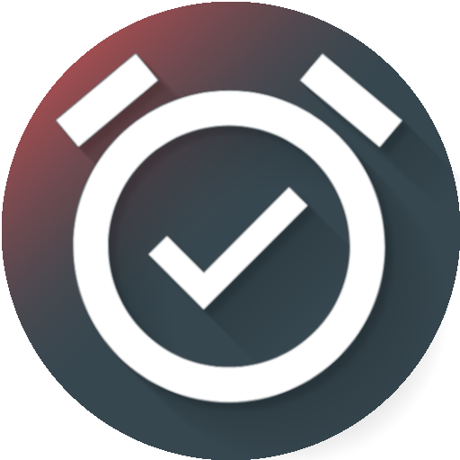
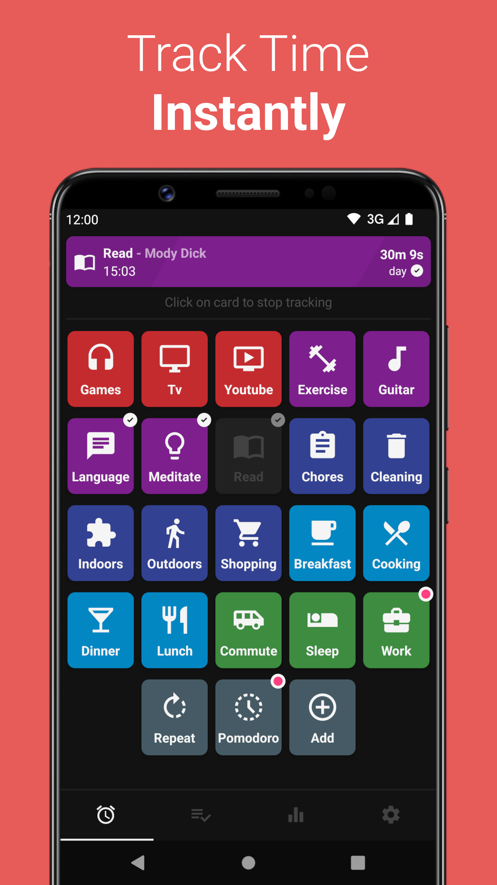
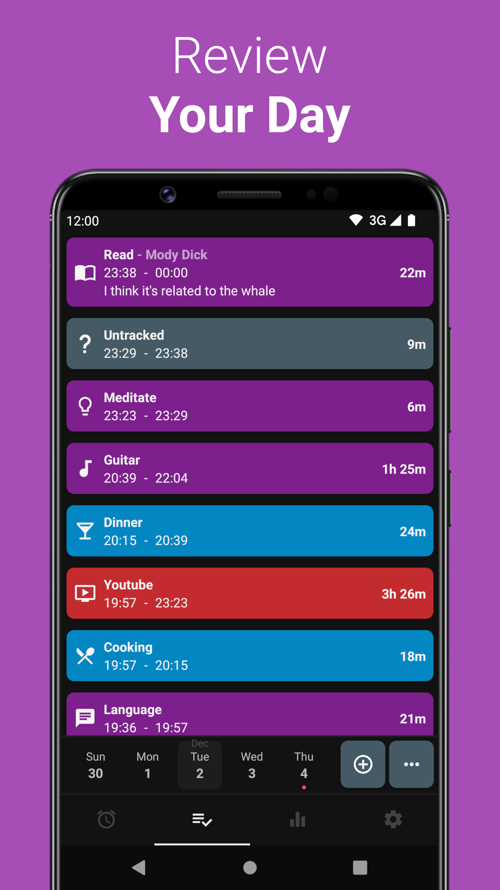
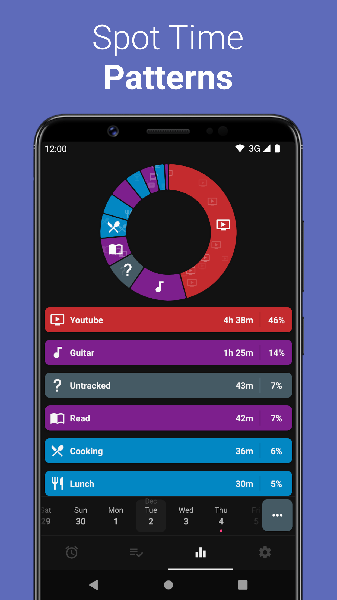
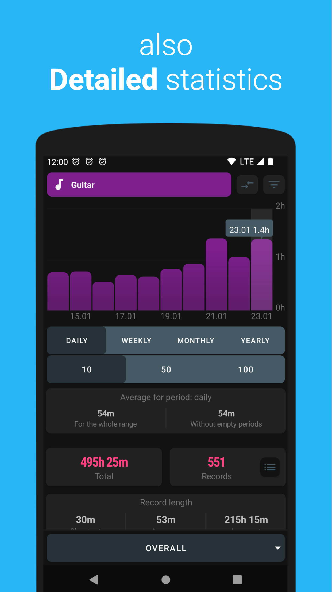
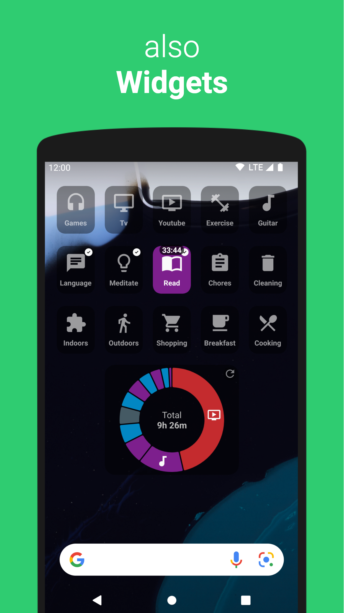
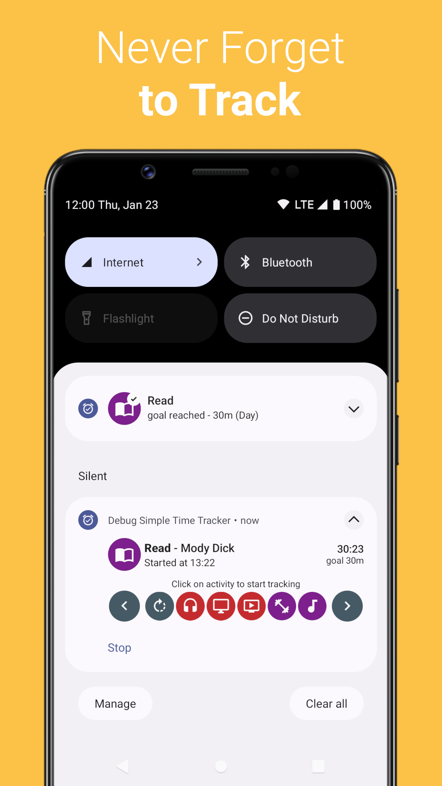
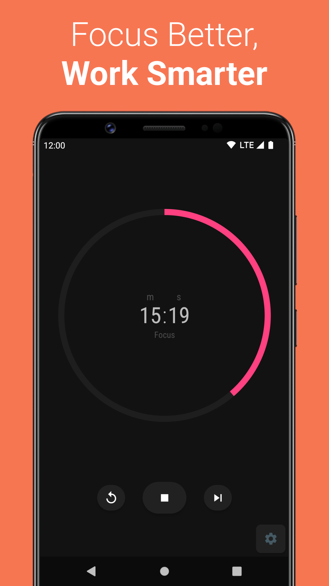

<h1 align="center">
    
     
    <b>Simple Time Tracker</b>
</h1>

    Simple app that helps track how much time you spend on all the useless activities in the world.

 
 

 
 

    

 

## Wear OS

## Technology stack
- Kotlin
- Multi module
- Single Activity
- MVVM (Jetpack ViewModel + LiveData)
- Jetpack Navigation
- Jetpack Compose
- Hilt
- Room, migrations
- Coroutines
- Wear OS
- Widgets
- Notifications
- Custom Views (Pie Chart, Bar Chart, Color Selection, Calendar)
- Recycler, custom Adapter Delegates, DiffUtils with Payloads
- Drag and Drop, Gesture detection
- Gradle Kotlin DSL
- View Binding
- Database backup and restore, export to csv, automatic backup
- Dark mode
- Unit tests, UI tests
- CI with github actions
- Emojis with EmojiCompat

## Build flavors
- base - F-Droid version, no google play services, no Wear OS support.
- play - Google Play version, with google play services, Wear OS support.

## Directory structure
    .
    ├── .github                               # CI files.
    ├── app                                   # Mobile app.
    ├── buildSrc                              # Deps and versions.
    ├── core                                  # Shared classes, strings.
    ├── data_local                            # Database.
    ├── domain                                # Business logic.
    ├── navigation                            # Navigation interfaces and screen params.
    ├── resources                             # Common resources between phone and watch apps.
    ├── wear                                  # Wear OS app.
    ├── wear_api                              # Mobile - Wear OS communication contracts.
    ├── features
    │   ├── feature_archive                   # Screen for archived data.
    │   ├── feature_base_adapter              # Shared recycler adapters.
    │   ├── feature_categories                # Screen for categories and tags.
    │   ├── feature_change_activity_filter    # Edit activity filter screen.
    │   ├── feature_change_category           # Edit category screen.
    │   ├── feature_change_complex_rule       # Edit complex rule screen.
    │   ├── feature_change_goals              # Edit goals common logic.
    │   ├── feature_change_record             # Edit record screen.
    │   ├── feature_change_record_tag         # Edit tag screen.
    │   ├── feature_change_record_type        # Edit type screen.
    │   ├── feature_change_running_record     # Edit timer screen.
    │   ├── feature_complex_rules             # Screen for complex rules list.
    │   ├── feature_date_edit                 # Data edit screen.
    │   ├── feature_dialogs                   # Dialogs.
    │   ├── feature_goals                     # Separate screen for goals.
    │   ├── feature_main                      # Main screen with tabs.
    │   ├── feature_notification              # Notifications.
    │   ├── feature_pomodoro                  # Pomodoro mode.
    │   ├── feature_records                   # One of main tabs, records list.
    │   ├── feature_records_all               # Screen showing all records.
    │   ├── feature_records_filter            # Dialog for records filters.
    │   ├── feature_running_records           # One of main tabs, timers.
    │   ├── feature_settings                  # One of main tabs, settings.
    │   ├── feature_shortcuts                 # Screen for all shortcuts.
    │   ├── feature_statistics                # One of main tabs, statistics.
    │   ├── feature_statistics_detail         # Screen showing detailed statistics.
    │   ├── feature_suggestions               # Screen for activity suggestions.
    │   ├── feature_tag_selection             # Screen for selecting tags.
    │   ├── feature_views                     # Custom views.
    │   ├── feature_wear                      # Phone app logic to connect to wear app.
    │   └── feature_widget                    # Widgets.

## Help for translators
Here are few steps to **translate the app in your language** ...
 _For app users: the best way to improve translation or to make app suggestions is to [open an issue](https://github.com/Razeeman/Android-SimpleTimeTracker/issues)._

**A. Edit translation file**
1. **Create a personal fork** of this project
2. In your repo, **edit translation file** for your language (they are stored in [folder: resources > src > main > res > values-xx ](https://github.com/Razeeman/Android-SimpleTimeTracker/tree/dev/resources/src/main/res)) + commit changes on your Dev branch.
 💡Tip: base your translation on the **official english translation [available here](https://github.com/Razeeman/Android-SimpleTimeTracker/blob/dev/resources/src/main/res/values/strings.xml)** and pay attention to **preserve the exact same number of lines between the 2 'strings.xml' files**.

**B. (_option_) Build and test your changes using the app**

In your repo:
1. **Run the "Build" job** on your 'Dev' branch
2. When the job ends, **get the APK** file (see Artifact)
3. **Copy the APK on your Android smartphone and install it** (requires to allow 'install app from unknown sources')
Note: ignore error message at app launch ... app will work normaly😉
4. Run the app, **check your translation** and re-start the process above to improve your translation ...

**C. Create a pull reguest** to suggest adding your translation to the app

When your translation is ready:
1. **Create a pull request** for with the new translation file to official repo
2. **Follow the code review**: in the PR, answer / explain the changes you've performed and improve your "proposal" with new commits (they will be added automaticaly to the opened PR).

Thanks, your are done 🎉. On next App release, all users will enjoy new labels in the app ...

## License

**Android App**

Copyright (C) 2020-2025
Anton Razinkov devrazeeman@gmail.com

This program is free software: you can redistribute it and/or modify
it under the terms of the GNU General Public License as published by
the Free Software Foundation, either version 3 of the License, or
(at your option) any later version.

This program is distributed in the hope that it will be useful,
but WITHOUT ANY WARRANTY; without even the implied warranty of
MERCHANTABILITY or FITNESS FOR A PARTICULAR PURPOSE.  See the
GNU General Public License for more details.

You should have received a copy of the GNU General Public License
along with this program.  If not, see <https://www.gnu.org/licenses/>.

**Wear OS App**

Copyright (C) 2023-2025
Joseph Hale https://jhale.dev, [@kantahrek](https://github.com/kantahrek), Anton Razinkov devrazeeman@gmail.com

This Source Code Form is subject to the terms of the Mozilla Public
License, v. 2.0. If a copy of the MPL was not distributed with this
file, You can obtain one at https://mozilla.org/MPL/2.0/.
